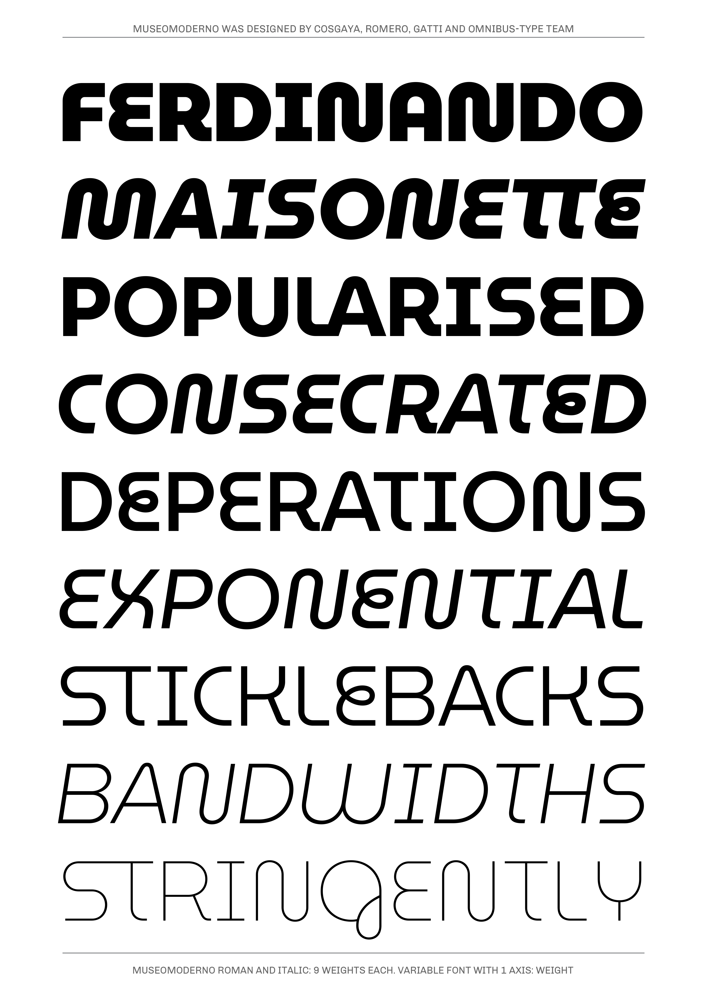

# MuseoModerno family

**Omnibus-Type**  
*SIL Open Font License, 1.1*

MuseoModerno: a contemporary geometric typeface for the new Identity of the Museum of Modern Art of Buenos Aires (Museo Moderno, AR). Designed by Marcela Romero, Héctor Gatti, Pablo Cosgaya & Omnibus-Type Team.

#### MuseoModerno Family contains:

* Thin / Thin Italic
* ExtraLight / Extralight Italic
* Light / Light Italic
* Regular / Italic
* Medium / Medium Italic
* SemiBold / SemiBold Italic
* Bold / Bold Italic
* ExtraBold / ExtraBold Italic
* Black / Black Italic

To contribute to the project contact [Omnibus-Type](http://omnibus-type.com/)

### Designers

* Pablo Cosgaya
* Héctor Gatti
* Marcela Romero

## Building

Fonts are built automatically by GitHub Actions - take a look in the "Actions" tab for the latest build.

If you particularly want to build fonts manually on your own computer, you will need to install the [`yq` utility](https://github.com/mikefarah/yq). On OS X with Homebrew, type `brew install yq`; on Linux, try `snap install yq`; if all else fails, try the instructions on the linked page.

Then:

* `make build` will produce font files.
* `make test` will run [FontBakery](https://github.com/googlefonts/fontbakery)'s quality assurance tests.
* `make proof` will generate HTML proof files.

## License

Copyright (c) 2020, Omnibus-Type (www.omnibus-type.com omnibus.type@gmail.com)

This Font Software is licensed under the SIL Open Font License, Version 1.1.
This license is copied below, and is also available with a FAQ at
http://scripts.sil.org/OFL

## Repository Layout

This font repository structure is inspired by [Unified Font Repository v0.3](https://github.com/unified-font-repository/Unified-Font-Repository), modified for the Google Fonts workflow.

======
## FONTLOG for the MuseoModerno fonts

This file provides detailed information on the MuseoModerno font software.  
This information should be distributed along with the MuseoModerno fonts and any derivative works.

### MuseoModerno is a typeface family that supports the following Unicode language range: 

* Basic Latin 					U+0020-U+007E
* Latin-1 Supplement 			U+00A0-U+00FF
* Latin Extended-A 				U+0100-U+017F
* Latin Extended Additional*	U+1E00-U+1EFF *(111/256)

**Character map to support MS Codepages:**
* 1252 Latin-1
* 1250 Latin-2 (Easter Europe)
* 1254 Turkish
* 1257 Windows Baltic
* 1258 Vietnamese
* Mac Roman

*To contribute to the project contact Omnibus-Type at omnibus.type@gmail.com*

**2022 June 13 (v1.003) New fonts**

- Added italics

**2019 December 21 (v1.001) Initial Commit**

- Initial Commit

### Acknowledgements

If you make modifications be sure to add your name (N), email (E), web-address
(if you have one) (W) and description (D). This list is in alphabetical order.

**N:** **Yorlmar Campos**  
**E:** omnibus.type@gmail.com  
**W:** http://www.omnibus-type.com  
**D:** Typeface development

**N:** **Pablo Cosgaya**  
**E:** omnibus.type@gmail.com  
**W:** http://www.omnibus-type.com  
**D:** Designer

**N:** **Héctor Gatti**  
**E:** omnibus.type@gmail.com  
**W:** http://www.omnibus-type.com  
**D:** Designer

**N:** **Marcela Romero**  
**E:** omnibus.type@gmail.com  
**W:** http://www.omnibus-type.com  
**D:** Designer